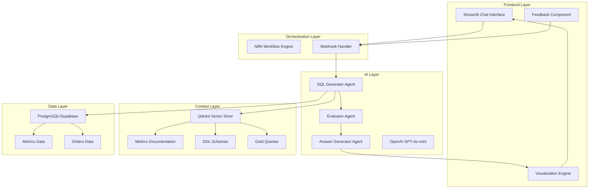
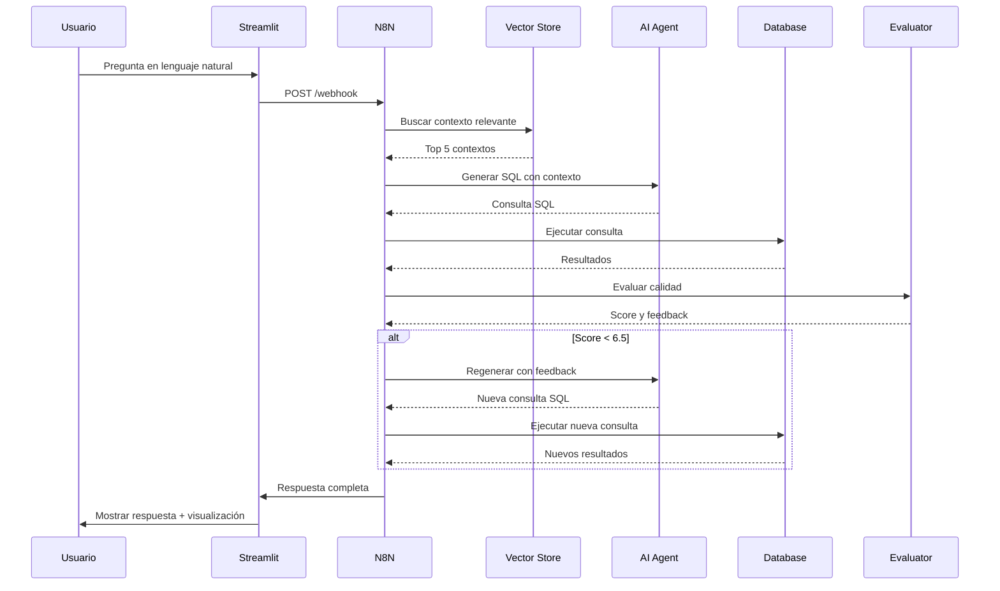
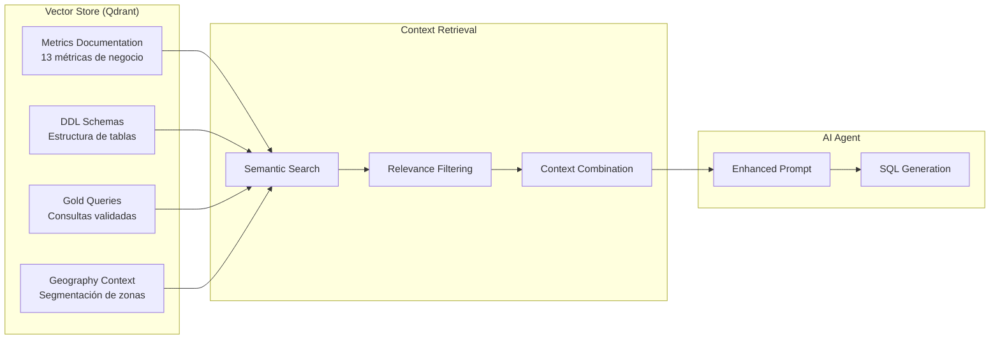
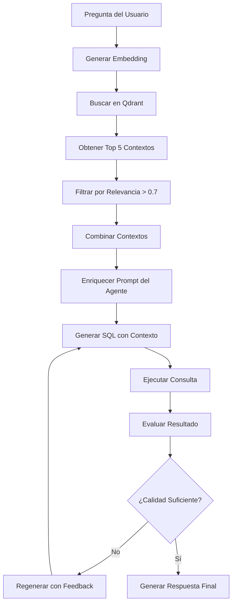
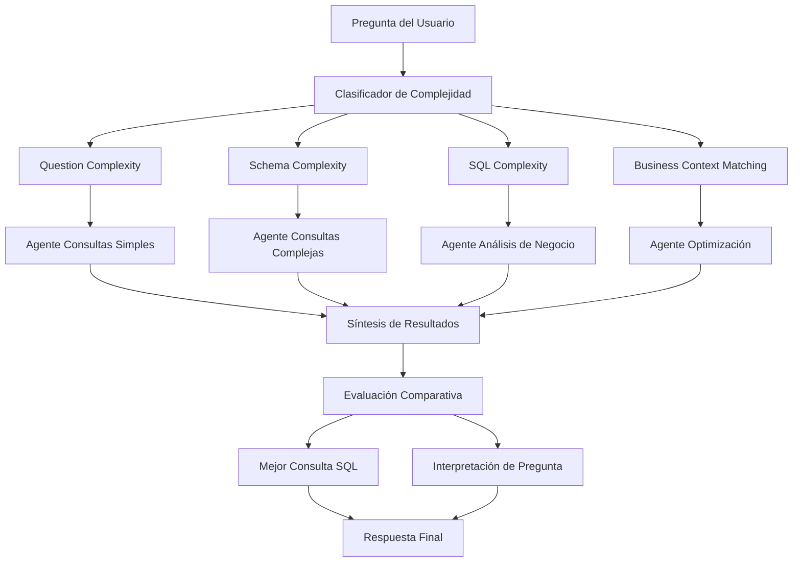
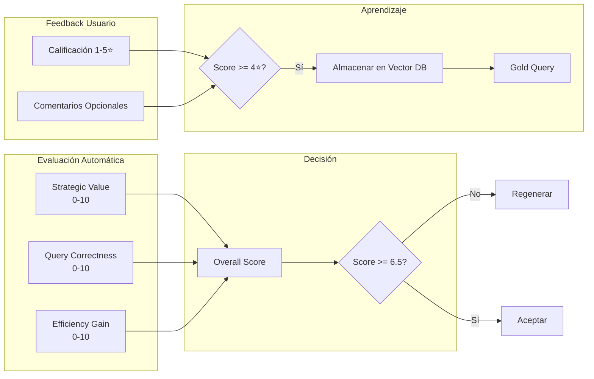
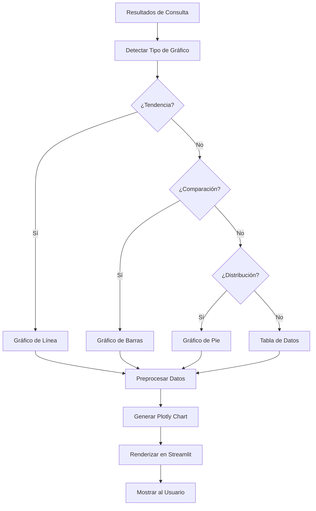
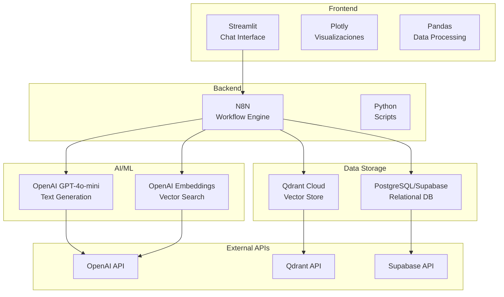
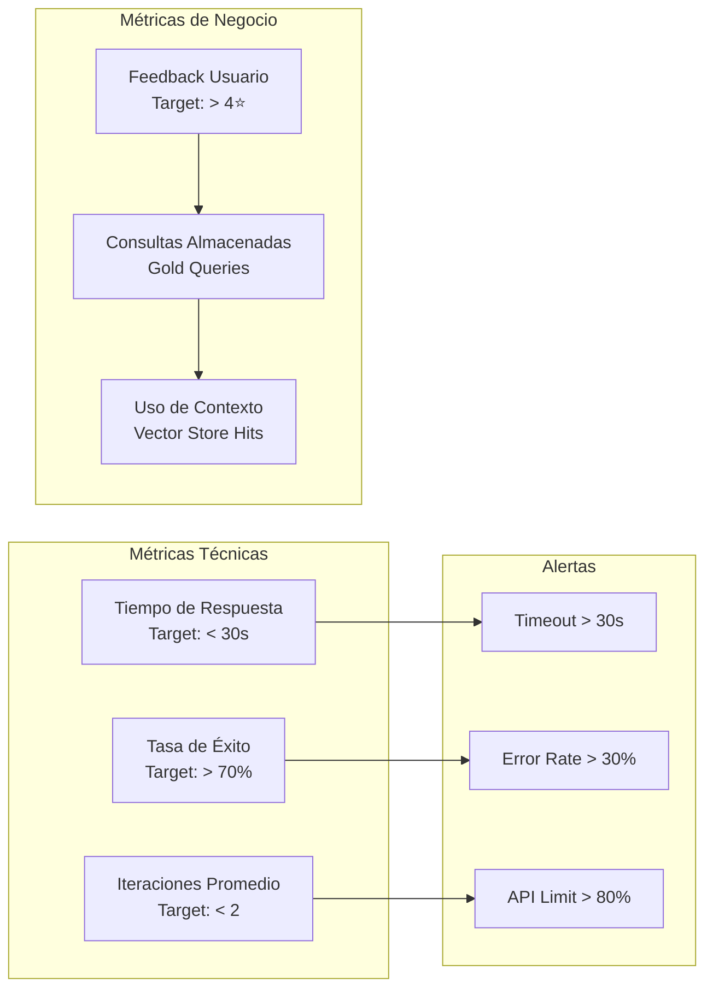
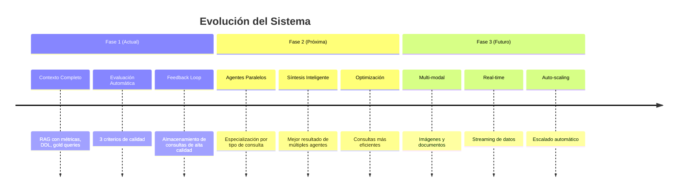

# 🏗️ Diagramas de Arquitectura - Rappi Analytics Agent

## 📊 Arquitectura General del Sistema

## 🔄 Flujo de Procesamiento de Consultas

## 🧠 Sistema de Contexto Completo

## 🔍 Proceso RAG (Retrieval-Augmented Generation)

## 🤖 Arquitectura de Múltiples Agentes (Futuro)

## 📊 Sistema de Evaluación y Feedback

## 🎯 Flujo de Visualización Automática

## 🔧 Stack Tecnológico

## 📈 Métricas de Rendimiento

## 🚀 Roadmap de Mejoras

---

*Diagramas generados para Rappi Analytics Agent v1.0*
*Última actualización: Diciembre 2024*
