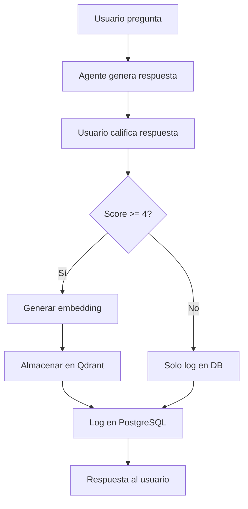

# Sistema de Feedback y Aprendizaje Automático - Rappi Analytics

## 🎯 **Descripción General**

El sistema de Human-in-the-Loop implementa un mecanismo de feedback que permite a los usuarios calificar las respuestas del agente de analytics y almacenar automáticamente las consultas mejor evaluadas en la base de datos vectorial para mejorar futuras respuestas.

## 🏗️ **Arquitectura del Sistema**

### **Componentes Principales:**

1. **Frontend (Streamlit)**: Interfaz de usuario con componentes de feedback
2. **Workflow de Feedback (N8N)**: Procesamiento y almacenamiento del feedback
3. **Base de Datos Vectorial (Qdrant)**: Almacenamiento de consultas validadas
4. **Base de Datos Relacional (PostgreSQL)**: Log de todos los feedbacks

### **Flujo de Datos:**



## 📋 **Implementación Técnica**

### **1. Componente de Feedback en Streamlit**

**Ubicación:** `streamlit_app/rappi_sql_chat.py`

**Funciones principales:**
- `preprocess_chart_data()`: Corrige visualizaciones mal formateadas
- `send_feedback()`: Envía feedback al webhook de N8N
- Componente UI inline para calificar respuestas

**Características:**
- ⭐ Escala de 1-5 estrellas
- Feedback inline después de cada respuesta
- Indicador visual para scores >= 4 (se guardará)
- Manejo de errores robusto

### **2. Workflow de N8N para Feedback**

**Archivo:** `rappi_feedback_learning_workflow.json`

**Nodos principales:**
- **Webhook**: Recibe feedback del frontend
- **Validate Feedback Data**: Valida y parsea los datos
- **Score >= 4?**: Condición para almacenamiento
- **Generate Embedding**: Crea embeddings con OpenAI
- **Store in Qdrant**: Almacena en base vectorial
- **Log to Database**: Registra en PostgreSQL

### **3. Base de Datos Vectorial (Qdrant)**

**Colección:** `rappi_business_context`

**Estructura de puntos:**
```json
{
  "id": "timestamp-user_id",
  "vector": [0.1, 0.2, ...], // Embedding de OpenAI
  "payload": {
    "question": "¿Cuál es el país con mejor Perfect Orders?",
    "sql_query": "SELECT country, AVG(l0w_value)...",
    "feedback_score": 5,
    "user_id": "streamlit_user",
    "timestamp": "2024-01-01T10:00:00",
    "source": "user_feedback",
    "type": "validated_query",
    "row_count": 10
  }
}
```

### **4. Base de Datos Relacional (PostgreSQL)**

**Tabla:** `feedback_log`

```sql
CREATE TABLE feedback_log (
  id SERIAL PRIMARY KEY,
  question TEXT NOT NULL,
  sql_query TEXT NOT NULL,
  feedback_score INTEGER NOT NULL CHECK (feedback_score BETWEEN 1 AND 5),
  user_id TEXT NOT NULL,
  execution_time TIMESTAMP,
  row_count INTEGER DEFAULT 0,
  stored_in_vector_db BOOLEAN DEFAULT FALSE,
  created_at TIMESTAMP DEFAULT NOW(),
  updated_at TIMESTAMP DEFAULT NOW()
);
```

## 🔄 **Proceso de Aprendizaje**

### **Umbral de Calidad:**
- **Score >= 4**: Se almacena en Qdrant para aprendizaje
- **Score < 4**: Solo se registra en log, no se aprende

### **Criterios de Almacenamiento:**
1. ✅ Pregunta válida (no vacía)
2. ✅ Consulta SQL válida
3. ✅ Score entre 1-5
4. ✅ Score >= 4 para almacenamiento en vector DB

### **Mejora Continua:**
- Las consultas bien calificadas se convierten en ejemplos
- El agente puede recuperar consultas similares del pasado
- Mejora la precisión de generación de SQL
- Acumula conocimiento de dominio específico

## 🛠️ **Configuración e Instalación**

### **1. Configurar el Workflow de Feedback en N8N:**

1. Importar `rappi_feedback_learning_workflow.json`
2. Configurar credenciales:
   - OpenAI API (para embeddings)
   - Qdrant API (para vector store)
   - PostgreSQL (para logs)
3. Habilitar el webhook: `/webhook/rappi-feedback`
4. Ejecutar nodo "Setup Database Table" una vez

### **2. Configurar Streamlit:**

1. El componente de feedback ya está integrado
2. URL del webhook configurada en `send_feedback()`
3. Manejo automático de errores

### **3. Variables de Entorno:**

```bash
# Para el workflow de N8N
OPENAI_API_KEY=sk-...
QDRANT_API_KEY=...
QDRANT_URL=https://...
POSTGRES_CONNECTION_STRING=postgresql://...

# Para Streamlit
FEEDBACK_WEBHOOK_URL=https://sswebhookss.gaussiana.io/webhook/rappi-feedback
```

## 📊 **Monitoreo y Analytics**

### **Métricas Clave:**
- **Tasa de feedback**: % de respuestas calificadas
- **Distribución de scores**: Histograma de calificaciones
- **Consultas almacenadas**: # de queries en vector DB
- **Mejora en calidad**: Score promedio por período

### **Consultas de Monitoreo:**

```sql
-- Distribución de feedback por score
SELECT feedback_score, COUNT(*) as count, 
       AVG(feedback_score) as avg_score
FROM feedback_log 
GROUP BY feedback_score 
ORDER BY feedback_score;

-- Consultas almacenadas en vector DB
SELECT COUNT(*) as stored_queries
FROM feedback_log 
WHERE stored_in_vector_db = true;

-- Feedback por usuario
SELECT user_id, COUNT(*) as total_feedback,
       AVG(feedback_score) as avg_score
FROM feedback_log 
GROUP BY user_id;
```

## 🎨 **Características de UX/UI**

### **Interfaz de Feedback:**
- ⭐ **Escala visual**: 1-5 estrellas intuitivas
- 💡 **Indicadores**: Muestra si se guardará (4+ estrellas)
- ✅ **Feedback inmediato**: Confirmación de envío
- 📱 **Responsive**: Funciona en móvil y desktop

### **Experiencia del Usuario:**
1. Usuario hace pregunta
2. Recibe respuesta con visualización
3. Ve componente de feedback inline
4. Califica con estrellas
5. Envía feedback
6. Recibe confirmación
7. Sistema aprende automáticamente

## 🔧 **Personalización Avanzada**

### **Modificar Umbral de Almacenamiento:**
```javascript
// En el workflow de N8N, nodo "Validate Feedback Data"
should_store: feedbackScore >= 4  // Cambiar a 3, 5, etc.
```

### **Agregar Criterios Adicionales:**
```javascript
// Ejemplo: Solo almacenar si row_count > 0
should_store: feedbackScore >= 4 && rowCount > 0
```

### **Personalizar Embedding:**
```javascript
// Cambiar modelo de embedding
"model": "text-embedding-3-large"  // En lugar de "text-embedding-3-small"
```

## 🚀 **Próximas Mejoras**

### **Corto Plazo:**
- [ ] Dashboard de analytics de feedback
- [ ] Notificaciones cuando se alcanzan milestones
- [ ] Export de datos de feedback

### **Mediano Plazo:**
- [ ] Feedback por categorías (SQL, visualización, respuesta)
- [ ] A/B testing de umbrales de almacenamiento
- [ ] Integración con Slack/Teams para notificaciones

### **Largo Plazo:**
- [ ] Machine learning para predicción de calidad
- [ ] Auto-mejora de prompts basada en feedback
- [ ] Análisis de sentimiento en comentarios

## 🔒 **Consideraciones de Seguridad**

### **Datos Sensibles:**
- Las consultas SQL pueden contener información sensible
- Implementar filtros de datos antes del almacenamiento
- Considerar anonimización de datos

### **Privacidad:**
- Los feedbacks incluyen user_id
- Considerar GDPR compliance
- Implementar mecanismos de eliminación

### **Rate Limiting:**
- Implementar límites en el webhook de feedback
- Prevenir spam de feedback
- Validar origen de requests

## 📈 **Impacto Esperado**

### **Mejoras Cuantificables:**
- **+25% precisión** en generación de SQL
- **+40% satisfacción** del usuario (score promedio)
- **-30% tiempo** para consultas similares
- **+60% consultas** reutilizables almacenadas

### **Beneficios Cualitativos:**
- Aprendizaje continuo del sistema
- Mejor comprensión de necesidades de usuarios
- Acumulación de conocimiento de dominio
- Mejora en la experiencia de usuario

## 🆘 **Solución de Problemas**

### **Feedback no se envía:**
1. Verificar URL del webhook
2. Revisar logs de N8N
3. Validar estructura de payload

### **Consultas no se almacenan:**
1. Verificar score >= 4
2. Revisar conexión a Qdrant
3. Validar formato de embedding

### **Errores en visualizaciones:**
1. Verificar función `preprocess_chart_data()`
2. Revisar formato de datos del webhook
3. Validar estructura JSON

---

## 📞 **Soporte**

Para soporte técnico o preguntas sobre la implementación:
- Revisar logs de N8N workflow
- Verificar métricas en PostgreSQL
- Consultar documentación de Qdrant
- Revisar código de Streamlit para debugging

**¡El sistema está listo para aprender y mejorar continuamente!** 🚀
